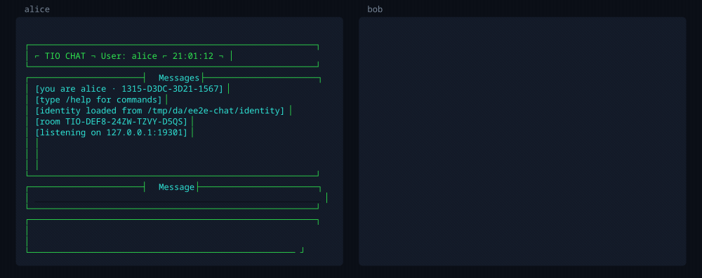

# TIO CHAT

**Encrypted chat with nobody in the middle. No server, no account, no cloud.**



*Two machines, no server in between. Bob joins with a room code, and each side
shows the other's key fingerprint so they can check nobody is in the middle.*

Most "private" messengers still route everything through somebody's
infrastructure. Even the good ones can tell you who talked to whom, and can be
compelled to keep trying.

This one has no infrastructure at all. Your computer talks to your friend's
computer, directly. There is no account to create, no phone number to hand
over, no company between you — and nothing anyone could subpoena, because
nothing exists to subpoena.

It is a **2.5 MB binary** that uses about **5 MB of memory**, written in Rust,
and it looks like a terminal from 1984.

---

## Try it in thirty seconds

**Linux and macOS**

```
curl -fsSL https://raw.githubusercontent.com/tjommilaskus/ee2e-chat/main/install.sh | sh
```

**Windows** — in cmd or PowerShell, with [Rust](https://rustup.rs) installed:

```
cargo install --git https://github.com/tjommilaskus/ee2e-chat
```

Then, on your machine:

```
e2ee
```

It asks your name and shows you a room code. Send that code to a friend, tell
them your address, and they are in. That is the whole setup.

---

## Why you might want it

**Nothing to trust.** Messages go straight from you to the person reading them.
No relay, no broker, no "we promise not to look" — the path simply does not
exist.

**Invite-only by design.** Every room has a code, and the handshake refuses
anyone who cannot prove they hold it. Knowing your address is not enough. The
code itself never crosses the wire.

**You can actually check who you are talking to.** Every identity has a
fingerprint. Read it aloud once, and you know for certain there is nobody in
the middle — the same mechanism as Signal's safety numbers.

**It finds everyone for you.** Point one person at one address. Gossip
introduces the rest, and the room assembles itself into a full mesh with every
pair connected directly.

**Small enough to read.** About 3,300 lines of Rust and 142 tests, on 14 direct
dependencies. Nothing runs in the background, nothing phones home, and there is
no daemon to forget you installed.

**Encryption that names its sender.** Not just "scrambled in transit" — a
message that decrypts could only have come from the person it claims, and
tampering with a single bit is detected.

---

## How a conversation starts

One person goes first and waits:

```
e2ee --name alice --listen 0.0.0.0:9999
```

Everyone else points at them, once:

```
e2ee --name bob   --connect 192.168.1.42:9999 --room TIO-K7M2-9QRX-4BNP-W8LZ
e2ee --name carol --connect 192.168.1.42:9999 --room TIO-K7M2-9QRX-4BNP-W8LZ
```

Bob and Carol never exchange addresses, yet end up talking to each other
directly. The room code is remembered, so it is only typed once.

Prefer not to use flags? Run `e2ee` with nothing and fill in the form, which
explains every field as you go.

| | |
|---|---|
| `Enter` | send |
| `PgUp` / `PgDn` | scroll back through the log |
| `Ctrl+E` | jump to the newest message and follow it again |
| `Esc` / `Ctrl+C` | quit |
| `/room` | show the room code and copy it |
| `/peers` | who is here, with fingerprints |
| `/clear` `/help` `/quit` | |

---

## Rooms: who gets in

A room has one code, and everyone in it holds the same one. A connection is
refused unless both ends prove they have it, so reaching the port is not enough
to get in — which is what makes it safe to expose one.

```
  room TIO-TEPJ-QYH0-DBKA-JPXR
  share that code with the people you want in it
```

One is created the first time you run the program, so a room is never
accidentally left open. The setup screen has a **Copy room code** button, and
`/room` copies it once you are chatting. `--new-room` starts a fresh one.

**The code is never transmitted.** Each side sends an HMAC over both public keys
and a fresh nonce from each. Watching a handshake reveals nothing about the
code, and a recorded exchange cannot be replayed into a later connection.

Anyone holding the code can join, and there is no way to revoke it for one
person — start a new room and give the new code to everyone else.

---

## Proving there is nobody in the middle

Encryption tells you a message is unreadable to others. It does not tell you
*whose* key you encrypted to. On first contact, someone positioned between two
peers could hand each of them their own key and read everything, with the
mathematics working perfectly the whole time.

That is what fingerprints are for:

```
/peers
   alice (you) · 29C5-2015-DE08-4502
   bob         · 4DC2-D703-300C-4017
```

Read them to each other over a channel an attacker does not control — a phone
call will do. If they match on both screens, nobody is intercepting you. Your
identity is stored, so this only has to be done once per person.

Display names carry no authority at all; anyone can pick any name, including
yours. If two identities turn up under one name — or somebody takes yours — the
interface says so and shows both fingerprints. **The fingerprint is the
identity.**

---

## Talking to someone across the internet

Peers must be able to reach each other, and two home connections generally
cannot. Two ways round it.

### A VPN, if you want it easy

[Tailscale](https://tailscale.com) needs no router access at all. Install it on
both machines, invite the other person to your tailnet, then:

```
tailscale ip -4          # e.g. 100.101.102.103
```

They connect to `100.101.102.103:9999`. Nothing else changes, and only your
tailnet can reach the port.

### Or forward a port

**Only one person needs to.** Everyone else connects to them.

| | |
|---|---|
| Protocol | **TCP** (no UDP is used) |
| Port | whatever `--listen` says — **9999** by default |
| Forward to | that machine's LAN address, same port |

Forward **TCP 9999** to, say, `192.168.1.42:9999`, and run with
`--listen 0.0.0.0:9999`. Open the firewall too:

```
sudo ufw allow 9999/tcp
sudo firewall-cmd --add-port=9999/tcp --permanent && sudo firewall-cmd --reload
```

Friends then connect to `<your public address>:9999` — `curl ifconfig.me` finds
it.

**Check for carrier-grade NAT first.** If your router's WAN address does not
match `curl ifconfig.me`, your ISP shares that address between customers and
forwarding cannot work. Use the VPN.

An open port gets found by scanners within hours. That is fine here only
because of the room code — without it, an open port would be an open room.

---

## Installing, in more detail

```
curl -fsSL https://raw.githubusercontent.com/tjommilaskus/ee2e-chat/main/install.sh | sh
```

Or `./install.sh` from a clone. It builds from source and installs to
`~/.local/bin`, so it never needs root. `--prefix DIR` puts it elsewhere,
`--uninstall` removes it, and `--name mychat` installs it under a different
command name if `e2ee` is taken on your machine.

**Rust is the only requirement.** If it is missing the script offers to install
it through rustup, which also lives under your home directory. `--with-rust`
accepts without asking. Or install it yourself:

| | |
|---|---|
| Arch | `sudo pacman -S rust` |
| Debian / Ubuntu | `sudo apt install cargo` |
| Fedora | `sudo dnf install cargo` |
| macOS | `brew install rust` |
| Anywhere | `curl --proto '=https' --tlsv1.2 -sSf https://sh.rustup.rs \| sh` |

Copying the room code wants a clipboard tool — `wl-clipboard` on Wayland,
`xclip` on X11, `pbcopy` on macOS, `clip` on Windows (already there) — but
everything else works without one.

Updating later:

```
e2ee update
```

### On Windows

There is no install script; cargo does the work instead. Install Rust from
[rustup.rs](https://rustup.rs), then, in either cmd or PowerShell:

```
cargo install --git https://github.com/tjommilaskus/ee2e-chat
```

Or `cargo install --path .` from a clone, which is the same thing against
source you already have.

That puts `e2ee.exe` in `%USERPROFILE%\.cargo\bin`, which rustup already adds
to your PATH. `cargo uninstall ee2e-chat` removes it — the package name, not
the command name. Re-running the install command upgrades in place, so
`e2ee update` does not apply on Windows and says so rather than half-working.

Three things worth knowing:

- **A first Rust install needs a linker**, which is better known before you
  start than after. The default toolchain links with Microsoft's, so
  `rustup-init` checks for the Visual Studio C++ Build Tools and offers to
  fetch them when they are missing — accept. It is a large download, comfortably
  over a gigabyte, and there is no way around it: without a linker the build
  compiles everything and only then fails, with `link.exe not found`. Machines
  that already have Visual Studio are fine. If that download is not one you can
  take, `rustup default stable-gnu` switches to a toolchain shipping its own
  linker, which needs none of it.
- **Use Windows Terminal** — the default on Windows 11, and in the Store on
  Windows 10 — or set your console font to Consolas or Cascadia Mono. Both cmd
  and PowerShell work, but the box-drawing characters and 24-bit colours need a
  font that has the glyphs. A legacy console still set to Raster Fonts shows
  boxes where `▶` should be.
- **Defender Firewall will ask** the first time you listen, which is exactly
  what it is for. Allow it on private networks, or nobody can connect *to* you
  — though you can still connect out to them.

### Platforms

| | |
|---|---|
| **Linux** | Supported. Developed and tested here. |
| **macOS** | Supported. Compiles cleanly, uses `pbcopy`. Config goes to `~/.config/ee2e-chat` rather than `~/Library/Application Support`. |
| **Windows** | Supported, in cmd and PowerShell. Config goes to `%APPDATA%\ee2e-chat`. Installs through cargo, so `e2ee update` does not apply. |

The one real difference is file permissions. On Unix the identity and room-code
files are created `0600`, and one found wider is tightened and reported to you
at startup. Windows has no mode bits: `%APPDATA%` already sits inside a profile
directory whose ACL admits only its owner, so the protection is the
filesystem's rather than this program's — which also means **there is no
warning if you use `--identity` to put a key somewhere shared.** Choose that
path with care on Windows.

### Your identity

Your keypair lives at `~/.config/ee2e-chat/identity`, or
`%APPDATA%\ee2e-chat\identity` on Windows. It is created on first run and
readable only by you. It is what keeps your fingerprint stable between
sessions, so someone who verified it last week still recognises you.

`--identity PATH` keeps it elsewhere, which is also how to run two identities
on one machine. `--ephemeral` uses a throwaway key, so nobody can recognise
you.

If that file is damaged the program stops rather than quietly making a new one.
A changed fingerprint is exactly the signal that means *somebody is
impersonating them*, and a disk problem must never be able to imitate an
attack.

---

## How it works

Every node is symmetric: it listens, it dials, and it holds one long-lived
X25519 keypair. The mesh is *full* — every peer connected directly to every
other — so no message is ever forwarded. A node encrypts each message
separately for each recipient and writes it straight down that connection.
Gossip discovers peers; it never routes messages.

### Cryptography

X25519 key agreement between the sender's long-term secret and the recipient's
public key, hashed with SHA-256 into an XChaCha20-Poly1305 key. This is NaCl's
`crypto_box` construction.

- **Authenticated.** The sender's long-term key is an input, so a ciphertext
  that opens correctly could only have been produced by its holder.
- **Direction-bound.** The sender's public key is authenticated as associated
  data. Both directions of a pair derive the same shared secret, so without
  this an attacker could reflect a message back at its author and have it
  appear to come from the peer.
- **Deniable.** Either party could have produced any message, so neither can
  prove authorship to anyone else. Deliberate, and what chat wants.

### Layout

| | |
|---|---|
| `crypto.rs` | key generation, seal/open, fingerprints |
| `messages.rs` | the plaintext message type |
| `protocol.rs` | wire frames and newline framing |
| `peers.rs` | peer registry, name clashes, dial collisions |
| `room.rs` | room codes, admission proofs |
| `identity.rs` | reading and writing the stored keypair |
| `secretfile.rs` | owner-only files for the key and the room code |
| `clipboard.rs` | handing text to the system clipboard tool |
| `node.rs` | listening, dialling, handshakes, gossip |
| `ui.rs` | the interface |

The first five touch neither disk nor network, which is what makes the awkward
parts — collision resolution in particular — testable without opening a socket.

---

## What it does not do

Every security tool should have this section, and most do not.

- **Peers must be able to reach each other.** Two hosts behind separate home
  NATs cannot open a TCP connection. Fixing that needs STUN/TURN
  infrastructure — servers, the thing this design removes. Works on a LAN, over
  a VPN, or with one peer port-forwarded.
- **A room code cannot be revoked.** It is one secret shared by everyone, so
  removing one person means starting a new room.
- **No record of who you have met.** Identities persist, but nothing remembers
  which fingerprint went with which name last time, so a familiar name arriving
  under a new key is not flagged.
- **No forward secrecy.** A pair's shared secret comes from long-term keys, so
  compromising one later exposes past messages.
- **Metadata is not hidden.** Peers see who is present and when messages are
  sent. Only content is protected.
- **Messages are not stored.** They live in memory for the session and are gone
  when you quit. Only the keypair is written to disk.

**It has not been audited.** It was written to understand how the pieces fit
together, and the limitations above are the ones that are *known*. Weigh that
accordingly against what you would use it for.

---

## Development

```
cargo test                    # 142 tests
cargo clippy --all-targets
```

The tests are worth a look: they cover impersonation, replayed and reflected
handshakes, tampered ciphertext, hostile gossip, and simultaneous dials — not
just that a message arrives.

CI runs all of it on Linux, macOS and Windows. Three permission tests are
Unix-only, since Windows has no mode bits to assert on, so the count is lower
there. `secretfile.rs`, `identity.rs`, `clipboard.rs` and `update.rs` are the
four modules that branch by platform — from a Unix machine it is worth
cross-checking that the Windows branch still compiles before pushing:

```
rustup target add x86_64-pc-windows-msvc
cargo check --target x86_64-pc-windows-msvc --all-targets
```

`cargo check` does not link, so this needs no MSVC toolchain.
